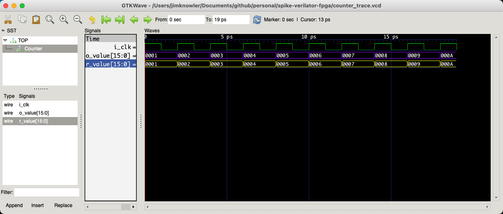

# Spike-Verilator-FPGA

Initial experiments in using verilator to create a C++ simulation of Verilog designs.

Tested on MacOSX v11.0.1 'Big Sur'

# Install Verilator

> brew install verilator

# Run Verilator on 'Counter.v'

Counter.v describes a simple counter module that increments its' value on the positive edge of each clock cycle.

## 1. Use verilator to create 

> $ verilator -Wall -cc Counter.v

## 2. Compile the CPP code generated by verilator

> $ cd obj_dir

> $ make -f VCounter.mk

> $ cd ..

## 3. Compile c++ test code + link with C++ simluation
> $ g++ -std=c++11 -I obj_dir -I /usr/local/share/verilator/include main.cpp /usr/local/share/verilator/include/verilated.cpp obj_dir/VCounter__ALL.a  -o main

## 4. Execute your C++ code
>  $ ./main

# Generating Traces from Verilator C++ simulation

## 1. Install GTKWave

> brew install xquartz

> brew install gtkwave

## 2. Use verilator to create C++ simulation - with trace enabled

> $ verilator -Wall --trace -cc Counter.v

## 3. Compile the CPP code generated by verilator

> $ cd obj_dir

> $ make -f VCounter.mk

> $ cd ..

## 4. Compile c++ test code + link with C++ simulation
> $ g++ -std=c++11 -I obj_dir -I /usr/local/share/verilator/include main_trace.cpp /usr/local/share/verilator/include/verilated.cpp /usr/local/share/verilator/include/verilated_vcd_c.cpp obj_dir/VCounter__ALL.a  -o main_trace

## 5. Execute your C++ code
>  $ ./main_trace

## 6. Open Trace file in GTKWave

> counter_trace.vcd

